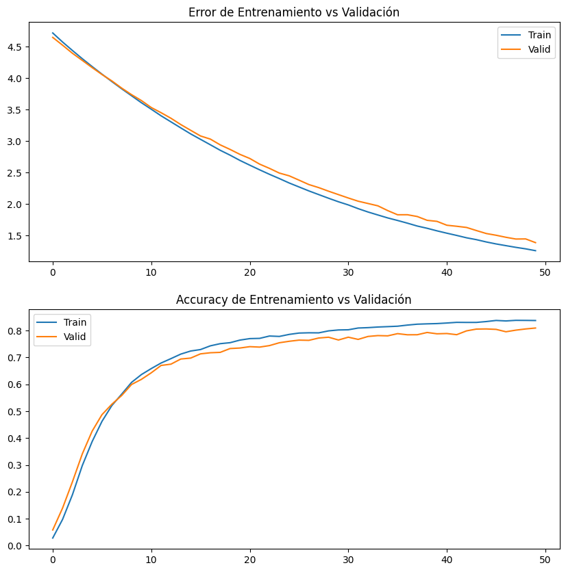
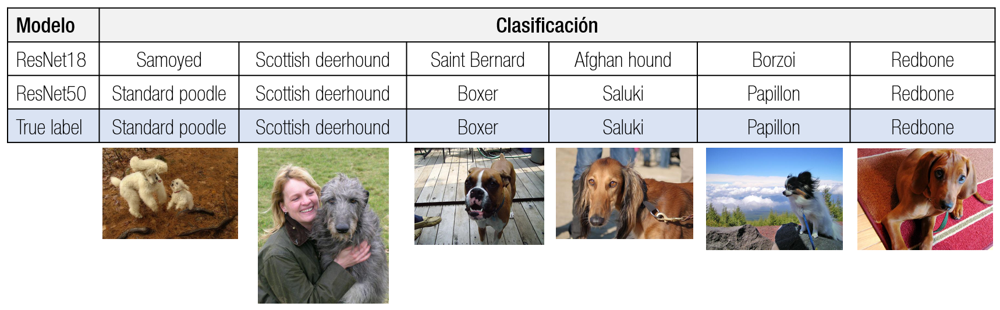
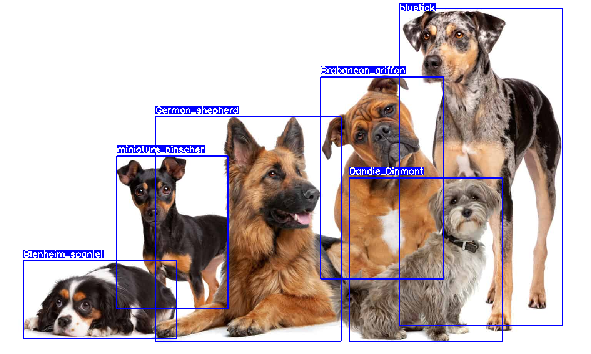
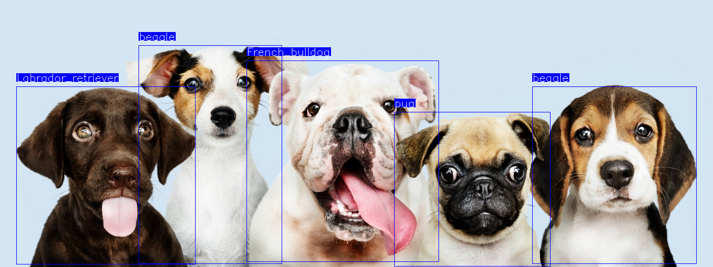

# Trabajo Final de Visión por Computadora II - Especialización en Inteligencia Artificial (FIUBA)

**Autor:** Karen Raczkowski

En este repositorio se encuentra el trabajo final de la materia Visión por Computadora II de la Especialización en Inteligencia Artificial de la FIUBA.

## Descripción del proyecto

- **Objetivo:** Identificar la raza de perros en imágenes.
- **Tipo de problema:** Clasificación multiclase.
- **Cantidad de clases:** 120 razas de perros, incluyendo 'Pekinese', 'Labrador', 'Bulldog', entre otras.
- **Dataset:** 20,580 imágenes, divididas en un 80% para entrenamiento y un 20% para test.
- **Arquitecturas de modelos utilizadas:** ResNet18, ResNet50.
- **Transfer Learning:** Implementado utilizando el conjunto de datos IMAGENET.
- **Data Augmentation:** Técnicas como Horizontal Flip, Resized Crop y Normalize.

## Análisis y Resultados

### Dataset 

#### ResNet18

#### ResNet50

### Resultados

